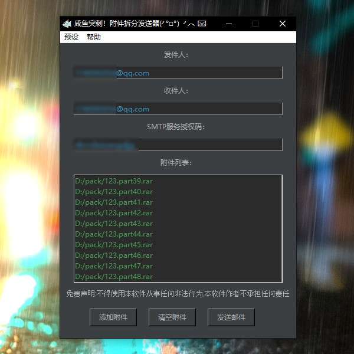

#   ReNamer
  
#   软件界面：

  - 

#   介绍：

  1. 可以大文件用解压软件 压缩成多个小压缩包 加上解压密码 自动批量发送邮件

  2. 请不要使用本软件从事任何非法行为！比如邮箱攻击 传盗版软件等 本软件作者不承担任何责任

#   开发：

  1. 源码在 Source 文件夹下 （Python 3.8.8环境下开发）

  2. 可以使用 Source\build.bat 运行

  3. 可以使用 Source\build.bat 打包 需要安装依赖
    
```
pip install pyinstaller 
```


#   下载：

## [点我免费下载（适用于Window系统电脑）](https://github.com/PMZeroSkyline/WPF_ReNamer/raw/master/ReNamer/ReNamer/bin/Release/ReNamer.exe)

### *本软件为一人开发 任何人都可以免费使用 没有广告 以开源 [点我下载我的其它免费应用](https://pmzeroskyline.github.io/FreeApps/)*

由 [guzhang0@gamil.com](https://github.com/PMZeroSkyline) 提供支持 欢迎错误反馈

#   请我喝杯咖啡 ♥：

